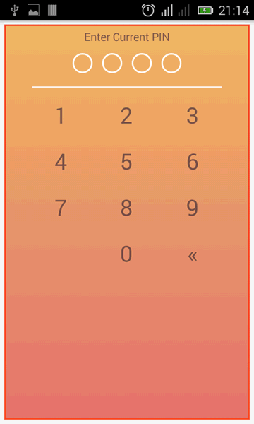

* seuntech (http://seuntech.com)
* +2348183874966


seuntech PINCODE
================

Android pin code library (API 14+)


Add the dependency to your build.gradle.

```
   //seuntech
   compile 'com.seuntech.seuntechpincode:pinpad:2.0.0'
```


![GIF][demo_gif]

### Features
* Fully customizable
* Translate to any language
* Encrypted PIN/Password
* Finger Print Support
* createpin,authpin,resetpin
* support fragment and non fragment
* Various callback options
* Easy installation
* Multiple customisation option

### Usage

Check this repo for example app. or create a custom class like below example. Depending on your need


### Intent
```
public class example_custom_activity extends pin_activity {


/*    for custom PINPAD design
    @Override
    public int get_layout() {
        return R.layout.activity_pin;
    }

    //set general text color
    @Override
    public int get_BodyColor() {
        return R.color.st_body;
    }

    //set text size, excluding keys
    @Override
    public int get_font_size(){
        return 14;
    }
    */

    @Override
    public void onForgot() {
        Toast.makeText(getApplicationContext(), "FORGOTSSSSSSSSSS", Toast.LENGTH_SHORT).show();
    }


    @Override
    public void onPinFail(int attempts) {
        Toast.makeText(getApplicationContext(), String.valueOf(attempts), Toast.LENGTH_SHORT).show();
    }

    @Override
    public void onPinSuccess(int attempts) {
        Toast.makeText(getApplicationContext(), String.valueOf(attempts), Toast.LENGTH_SHORT).show();
    }


    @Override
    public void onFingerFail() {
        Toast.makeText(getApplicationContext(), "Yess Finger", Toast.LENGTH_SHORT).show();
    }

    @Override
    public void onFingerSuccess() {
        Toast.makeText(getApplicationContext(), "No finger", Toast.LENGTH_SHORT).show();
    }


}
```

### Fragment
```
public class example_custom_fragment extends pin_fragment {


/*    for custom PINPAD design
    @Override
    public int get_layout() {
        return R.layout.activity_pin;
    }

    //set general text color
    @Override
    public int get_BodyColor() {
        return R.color.st_body;
    }

    //set text size, excluding keys
    @Override
    public int get_font_size(){
        return 14;
    }
    */


    @Override
    public void onForgot() {
        Toast.makeText(getActivity(), "FORGOTSSSSSSSSSS", Toast.LENGTH_SHORT).show();
    }

    @Override
    public void onPinFail(int attempts) {
        Toast.makeText(getActivity(), String.valueOf(attempts), Toast.LENGTH_SHORT).show();
    }

    @Override
    public void onPinSuccess(int attempts) {
        Toast.makeText(getActivity(), String.valueOf(attempts), Toast.LENGTH_SHORT).show();
        Intent intent = new Intent(getActivity(), example_MainActivity.class);
        startActivity(intent);
    }

    @Override
    public void onFingerSuccess() {

    }

    @Override
    public void onFingerFail() {

    }
}
```


========
#### Calling from application that needs PINCODE Protection
```
public class example_MainActivity extends Activity {

    ManagePin Mp;
    private final int SUCCESS_REQUEST = 1111;

    @Override
    protected void onCreate(Bundle savedInstanceState) {
        super.onCreate(savedInstanceState);
        setContentView(R.layout.activity_main);

//Initialise Managepin
        Mp = ManagePin.getInstance(this);
    }


    //PINCODE Options
    //AppConf.CREATE_PIN = Create New PIN
    //AppConf.AUTH_PIN = Authenticate PIN
    //AppConf.RESET_PIN = Reset PIN
    //Intent Example
    public void inte(View v) {
        if (!Mp.isPinSet()) {
            Intent intent = new Intent(this, example_custom_activity.class);
            intent.putExtra(AppConf.AUTH_TYPE, AppConf.CREATE_PIN);
            startActivityForResult(intent, SUCCESS_REQUEST);
        } else {
            Intent intent = new Intent(this, example_custom_activity.class);
            intent.putExtra(AppConf.AUTH_TYPE, AppConf.RESET_PIN);
            startActivityForResult(intent, SUCCESS_REQUEST);
        }
    }


    @Override
    protected void onActivityResult(int requestCode, int resultCode, Intent data) {
        super.onActivityResult(requestCode, resultCode, data);

        switch (requestCode) {
            case SUCCESS_REQUEST:
                Intent intent = new Intent(this, example_MainActivity.class);
                startActivity(intent);
                finish();
                break;
        }
    }
    
    
    
    //Fragment Example
    public void frag(View v) {
        Fragment fragment = new example_custom_fragment();
        Bundle bundle = new Bundle();
        bundle.putString(AppConf.AUTH_TYPE, AppConf.AUTH_PIN);
        fragment.setArguments(bundle);
        FragmentManager fragmentManager = getFragmentManager();
        fragmentManager.beginTransaction().replace(R.id.frame_container, fragment).addToBackStack("pin").commit();
    }

}

```

#END....................

========
### Customization

Method:
-------------------
```
//You must initialise ManagePin first
ManagePin Mp = ManagePin.getInstance(this);

```


| Method | description |
|:---|:---|
| Mp.setLogoId(R.drawable.logo); |Set Logo  |
| Mp.HideLogo(); | Hide Logo |
| Mp.clearPin(); | Remove PIN on logout |
| Mp.isPinSet();  | Check if PIN is set (returns True or False) |
|AppConf.HIDE_BAR = true;|Touggle Action Bar|


Color:
-------------------
```
    <color name="st_body">#FFFFFF</color>
    <color name="st_warning">#AE3636</color>
    <color name="st_success">#119E26</color>
    <color name="st_empty_circle">#FFFFFF</color>
    <color name="st_filed_circle">#505253</color>
```

String:
-------------------
```
    <string name="st_creat_for_digit_pin">Create 4 Digit PIN</string>
    <string name="st_enter_current_pin">Enter Current PIN</string>
    <string name="st_confirm_pin">Confirm PIN?</string>
    <string name="st_enter_new_pin">Enter New PIN</string>
    <string name="st_forgot_password">Forgot Password?</string>
    <string name="st_enterpin_tounlock">Enter PIN to unlock</string>
    <string name="st_finger_error">Finger Print Error</string>
    <string name="st_finger_not_match">Finger Print do not match</string>
    <string name="st_finger_match">Finger Print Match</string>
```

The activity_pin Layout:
-------------------
From you Custom Activity or Custom Fragment

```
    @Override
    public int get_layout() {
        return R.layout.activity_pin;
    }

    //set general text color
    @Override
    public int get_BodyColor() {
        return R.color.st_body;
    }

    //set text size, excluding keys
    @Override
    public int get_font_size(){
        return 14;
    }
```

activity_pin XML Layout:
------------------------
```xml
<?xml version="1.0" encoding="utf-8"?>
<LinearLayout xmlns:android="http://schemas.android.com/apk/res/android"
    xmlns:app="http://schemas.android.com/apk/res-auto"
    xmlns:tools="http://schemas.android.com/tools"
    android:layout_width="match_parent"
    android:layout_height="match_parent"
    android:orientation="vertical"
    android:padding="0dp">
    >

    <ImageView
        android:id="@+id/seuntech_logo"
        android:layout_width="wrap_content"
        android:layout_height="40dp"
        android:layout_gravity="center"
        android:layout_margin="10dp"
        android:adjustViewBounds="true"
        android:src="@mipmap/ic_launcher"
        android:visibility="gone" />


    <ScrollView xmlns:android="http://schemas.android.com/apk/res/android"
        xmlns:app="http://schemas.android.com/apk/res-auto"
        xmlns:tools="http://schemas.android.com/tools"
        android:layout_width="match_parent"
        android:layout_height="match_parent"
        android:layout_margin="5dp"
        android:background="@android:color/white"
        android:fillViewport="true">


        <RelativeLayout
            android:layout_width="match_parent"
            android:layout_height="wrap_content"
            android:background="@drawable/orangebg"
            android:gravity="center_horizontal"
            android:orientation="vertical"
            android:paddingBottom="10dp"
            android:paddingLeft="30dp"
            android:paddingRight="30dp"
            android:paddingTop="5dp">

            <TextView
                android:id="@+id/seuntech_instruction"
                android:layout_width="wrap_content"
                android:layout_height="wrap_content"
                android:layout_centerHorizontal="true"
                android:text="-"
                android:textColor="@android:color/white"
                android:textSize="14dp" />

            <LinearLayout
                android:id="@+id/seuntech_box"
                android:layout_width="match_parent"
                android:layout_height="wrap_content"
                android:layout_below="@+id/seuntech_instruction"
                android:layout_marginBottom="5dp"
                android:layout_marginTop="5dp"
                android:orientation="horizontal">

                <LinearLayout
                    android:layout_width="match_parent"
                    android:layout_height="wrap_content"
                    android:orientation="vertical">

                    <LinearLayout
                        android:layout_width="wrap_content"
                        android:layout_height="wrap_content"
                        android:layout_gravity="center_horizontal"
                        android:orientation="horizontal">

                        <ImageView
                            android:id="@+id/seuntech_circle1"
                            android:layout_width="wrap_content"
                            android:layout_height="wrap_content"
                            android:layout_margin="6dp"
                            android:src="@drawable/pin_circle" />

                        <ImageView
                            android:id="@+id/seuntech_circle2"
                            android:layout_width="wrap_content"
                            android:layout_height="wrap_content"
                            android:layout_margin="6dp"
                            android:src="@drawable/pin_circle" />

                        <ImageView
                            android:id="@+id/seuntech_circle3"
                            android:layout_width="wrap_content"
                            android:layout_height="wrap_content"
                            android:layout_margin="6dp"
                            android:src="@drawable/pin_circle" />

                        <ImageView
                            android:id="@+id/seuntech_circle4"
                            android:layout_width="wrap_content"
                            android:layout_height="wrap_content"
                            android:layout_margin="6dp"
                            android:src="@drawable/pin_circle" />
                    </LinearLayout>

                </LinearLayout>

            </LinearLayout>

            <TextView
                android:id="@+id/seuntech_forgot"
                android:layout_width="wrap_content"
                android:layout_height="wrap_content"
                android:layout_below="@+id/seuntech_box"
                android:layout_centerInParent="true"
                android:maxLines="1"
                android:text="Forget PIN?"
                android:textColor="@android:color/white"
                android:textSize="14dp" />

            <LinearLayout
                android:id="@+id/seuntech_bar"
                android:layout_width="match_parent"
                android:layout_height="1dp"
                android:layout_below="@+id/seuntech_forgot"
                android:layout_margin="5dp"
                android:background="@color/st_body"
                android:orientation="horizontal" />

            <include
                android:id="@+id/seuntech_keyboard"
                layout="@layout/view_keyboard"
                android:layout_width="match_parent"
                android:layout_height="wrap_content"
                android:layout_above="@+id/seuntech_fingerprint"
                android:layout_below="@+id/seuntech_bar" />

            <ImageView
                android:id="@+id/seuntech_fingerprint"
                android:layout_width="wrap_content"
                android:layout_height="wrap_content"
                android:layout_above="@+id/seuntech_fingerprint_message"
                android:layout_centerHorizontal="true"
                android:src="@drawable/ic_fp_40px" />

            <TextView
                android:id="@+id/seuntech_fingerprint_message"
                android:layout_width="wrap_content"
                android:layout_height="wrap_content"
                android:layout_alignParentBottom="true"
                android:layout_centerInParent="true"
                android:maxLines="1"
                android:text="Scan Finger Print"
                android:textColor="@android:color/white"
                android:textSize="14dp" />

        </RelativeLayout>
    </ScrollView>

</LinearLayout>
```


Included Keyboard XML Layout:
-------------------
```xml
<?xml version="1.0" encoding="utf-8"?>
<LinearLayout xmlns:android="http://schemas.android.com/apk/res/android"
    android:id="@+id/seuntech_keyboard_view"
    android:layout_width="match_parent"
    android:layout_height="wrap_content"
    android:orientation="vertical">

    <LinearLayout
        android:id="@+id/seuntech_first_row"
        android:layout_width="match_parent"
        android:layout_height="wrap_content"
        android:orientation="horizontal"
        android:weightSum="3">

        <TextView
            android:id="@+id/seuntech_button_1"
            android:layout_width="0dp"
            android:layout_height="wrap_content"
            android:layout_weight="1"
            android:padding="10dp"
            android:text="1"
            android:textAlignment="center"
            android:textColor="@color/st_body"
            android:textSize="28sp" />

        <TextView
            android:id="@+id/seuntech_button_2"
            android:layout_width="0dp"
            android:layout_height="wrap_content"
            android:layout_weight="1"
            android:padding="10dp"
            android:text="2"
            android:textAlignment="center"
            android:textColor="@color/st_body"
            android:textSize="28sp" />

        <TextView
            android:id="@+id/seuntech_button_3"
            android:layout_width="0dp"
            android:layout_height="wrap_content"
            android:layout_weight="1"
            android:padding="10dp"
            android:text="3"
            android:textAlignment="center"
            android:textColor="@color/st_body"
            android:textSize="28sp" />

    </LinearLayout>

    <LinearLayout
        android:id="@+id/seuntech_second_row"
        android:layout_width="match_parent"
        android:layout_height="wrap_content"
        android:layout_below="@+id/seuntech_first_row"
        android:orientation="horizontal"
        android:weightSum="3">

        <TextView
            android:id="@+id/seuntech_button_4"
            android:layout_width="0dp"
            android:layout_height="wrap_content"
            android:layout_weight="1"
            android:padding="10dp"
            android:text="4"
            android:textAlignment="center"
            android:textColor="@color/st_body"
            android:textSize="28sp" />

        <TextView
            android:id="@+id/seuntech_button_5"
            android:layout_width="0dp"
            android:layout_height="wrap_content"
            android:layout_weight="1"
            android:padding="10dp"
            android:text="5"
            android:textAlignment="center"
            android:textColor="@color/st_body"
            android:textSize="28sp" />

        <TextView
            android:id="@+id/seuntech_button_6"
            android:layout_width="0dp"
            android:layout_height="wrap_content"
            android:layout_weight="1"
            android:padding="10dp"
            android:text="6"
            android:textAlignment="center"
            android:textColor="@color/st_body"
            android:textSize="28sp" />

    </LinearLayout>

    <LinearLayout
        android:id="@+id/seuntech_third_row"
        android:layout_width="match_parent"
        android:layout_height="wrap_content"
        android:layout_below="@+id/seuntech_second_row"
        android:orientation="horizontal"
        android:weightSum="3">

        <TextView
            android:id="@+id/seuntech_button_7"
            android:layout_width="0dp"
            android:layout_height="wrap_content"
            android:layout_weight="1"
            android:padding="10dp"
            android:text="7"
            android:textAlignment="center"
            android:textColor="@color/st_body"
            android:textSize="28sp" />

        <TextView
            android:id="@+id/seuntech_button_8"
            android:layout_width="0dp"
            android:layout_height="wrap_content"
            android:layout_weight="1"
            android:padding="10dp"
            android:text="8"
            android:textAlignment="center"
            android:textColor="@color/st_body"
            android:textSize="28sp" />

        <TextView
            android:id="@+id/seuntech_button_9"
            android:layout_width="0dp"
            android:layout_height="wrap_content"
            android:layout_weight="1"
            android:padding="10dp"
            android:text="9"
            android:textAlignment="center"
            android:textColor="@color/st_body"
            android:textSize="28sp" />

    </LinearLayout>

    <LinearLayout
        android:id="@+id/seuntech_fourth_row"
        android:layout_width="match_parent"
        android:layout_height="wrap_content"
        android:layout_below="@+id/seuntech_third_row"
        android:orientation="horizontal"
        android:weightSum="3">

        <TextView
            android:id="@+id/seuntech_button_10"
            android:layout_width="0dp"
            android:layout_height="wrap_content"
            android:layout_weight="1"
            android:padding="10dp"
            android:textColor="@color/st_body"
            android:textSize="28sp" />

        <TextView
            android:id="@+id/seuntech_button_0"
            android:layout_width="0dp"
            android:layout_height="wrap_content"
            android:layout_weight="1"
            android:padding="10dp"
            android:text="0"
            android:textAlignment="center"
            android:textColor="@color/st_body"
            android:textSize="28sp" />

        <TextView
            android:id="@+id/seuntech_button_clear"
            android:layout_width="0dp"
            android:layout_height="wrap_content"
            android:layout_weight="1"
            android:padding="10dp"
            android:text=""
            android:textAlignment="center"
            android:textColor="@color/st_body"
            android:textSize="28sp" />

    </LinearLayout>

</LinearLayout>
```


## Todo
* Touggle Between PIN and Password
* Set PIN Lenght


## Credits
* Seun Makinde Williams* (http://seuntech.com)


# LICENSE

```
Copyright (C) 2018 seuntech

Licensed under the Apache License, Version 2.0 (the "License");
you may not use this file except in compliance with the License.
You may obtain a copy of the License at

http://www.apache.org/licenses/LICENSE-2.0

Unless required by applicable law or agreed to in writing, software
distributed under the License is distributed on an "AS IS" BASIS,
WITHOUT WARRANTIES OR CONDITIONS OF ANY KIND, either express or implied.
See the License for the specific language governing permissions and
limitations under the License.
```

[demo_gif]: app/src/main/res/raw/sample.gif